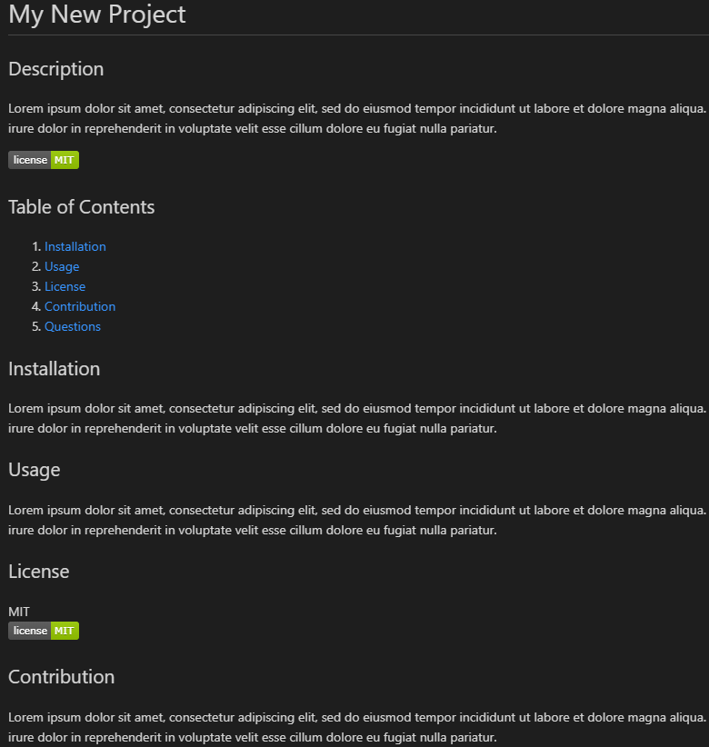

# README-Generator
Unit 09 Node.js and ES6+ Homework: Good README Generator

https://vimeo.com/439501742

## Task Description

The task for this weeks homework was to create a README generator using JavaScript, node.js and the FS library. The generator had to prompt users for input through the command line and create a polished looking README based on the responses. The README also had to include a table that links to sections of the README.

## License & copyright

© Chris R, University of Adelaide Coding Bootcamp
